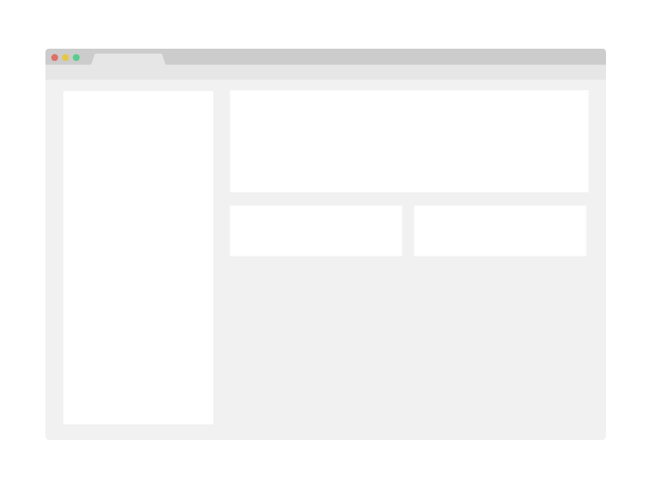

<div align="center" markdown>


# Example Project


**An awesome README template to jumpstart your projects!**

[Explore The Docs >](https://example.com)

</div>

## About Example Project



There are many great README templates available on GitHub; however, I didn't
find one that really suited my needs so I created this enhanced one. I want to
create a README template so amazing that it'll be the last one you ever need -- I think this is it.

### Overview

### Features

## Getting Started

This is an example of how you may give instructions on setting up your project locally. To get a local copy up and running follow these simple example steps.

### Prerequisites

This is an example of how to list things you need to use the software and how to install them.

- npm
  ```shell
  npm install npm@latest -g
  ```

### Installation

1. Get a free API Key at https://example.com.
2. Clone the repo.
   ```shell
   git clone https://github.com/your_username_/Project-Name.git
   ```

### Usage

Use this space to show useful examples of how a project can be used. Additional screenshots, code examples and demos work well in this space. you may also link to more resources.

_For more examples, please refer to the [Documentation]()._

### Configuration

## Project Components

### Built With

### Roadmap

See the [open issues]() for a full list of proposed features (and known issues)

## Contributing

Contributions are what make the open-source community such an amazing place to learn, inspire and create! Any contributions you make are **greatly appreciated**.

### How To Contribute

### Contributors

## License

Distributed under the MIT License. See `License.txt` for more information.

## Acknowledgements

---

Your Name - @your_twitter - email@example.com

Project Link: https://github.com/your_username/repo_name

https://choosealicense.com/

https://www.webfx.com/tools/emoji-cheat-sheet/

https://flexbox.malven.co/

https://grid.malven.co/

https://shields.io/

https://pages.github.com/

https://fontawesome.com/

https://react-icons.github.io/react-icons/search